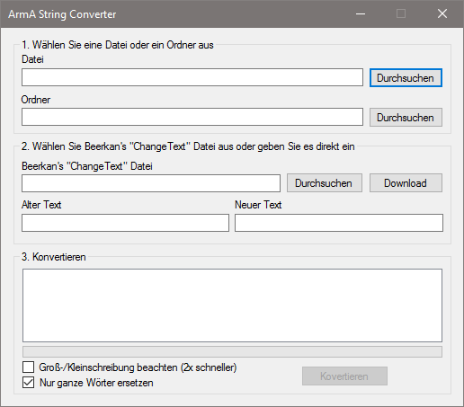

# ArmA String Converter

  

##Inhalt
Hier finden Sie den Sourcecode für das Programm.

#Funktionen:
- Einfache Bedienung.
- Extrem schnell (bis zu 480000 Änderungen pro Sekunde)
- Open Source!
- Unterstützung für Beerkan s & Dingo-J s "ChangeText" Datei.

#Installation:
- Keine. Das Programm kann sofort ohne Installation gestartet und benutzt werden.

#Anforderung:
- 1GHz CPU.
- 32MB freier Arbeitsspeicher.
- 1MB freier Festplattenspeicher.
- .NET Framework 2.0 (bereits seit Windows XP enthalten)
- Unterstützte Betriebssysteme:Windows XP, Vista, 7, 8

#Maximale Leistung:
Mit Beachtung auf Groß- und Kleinschreibung:
- Eine Datei: ~480000 Änderungen pro Sekunde.
- Mehrere Dateien: ~434000 Änderungen pro Sekunde.
Ohne Beachtung auf Groß- und Kleinschreibung:
- Eine Datei: ~323000 Änderungen pro Sekunde.
- Mehrere Dateien: ~252000 Änderungen pro Sekunde.

#Unterstützte Sprachen:
- Englisch
- Deutsch

#Bedienung:
- Wählen Sie eine Datei oder ein Ordner aus
- Wählen Sie Beerkans �ChangeText� Datei aus oder geben Sie direkt den zu ersetzenden und den ersetzenden Text ein
- Wählen Sie bei Bedarf den Parameter für die Beachtung der Groß- und Kleinschreibung aus
- Drücken Sie auf Konvertieren, um den Prozess zu starten

##Geschichte
Sechs Tage, nachdem Dingo-J sein Tool "Arma 3 Alpha to Beta Mission Converter" veröffentlicht hatte, entdeckte ich es bei ArmAholic und sah, dass man damit nur eine Datei gleichzeitig bearbeiten kann. Nach ein paar Programmierstunden hatte ich meine eigene Lösung, damit mehr Funktionen zur Auswahl stehen. So kann man mit "ArmA String Converter" jede ausgewählte oder im ausgewählten Ordner enthaltene ArmA/OFP Textdatei (txt, hpp, htm, html, sqs, sqf, fsm, bifsm, sqm, cpp, xml, bikb) automatisch korrigieren lassen. Das Projekt steht zusätzlich als Open Source zur Verfügung, damit die Community vielleicht irgendwann etwas Besseres daraus machen kann.